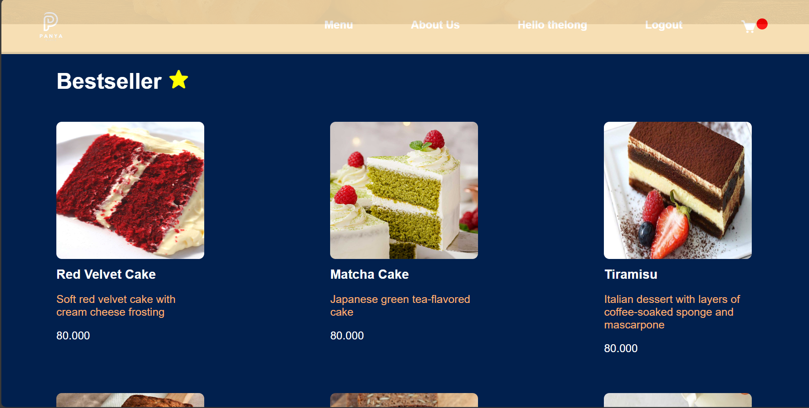
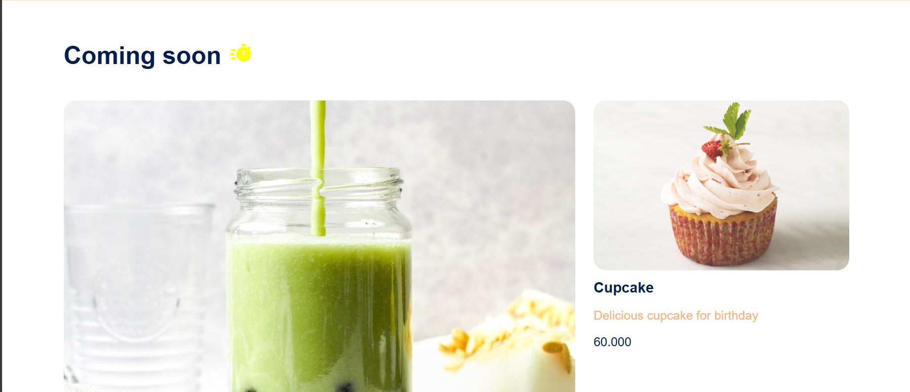
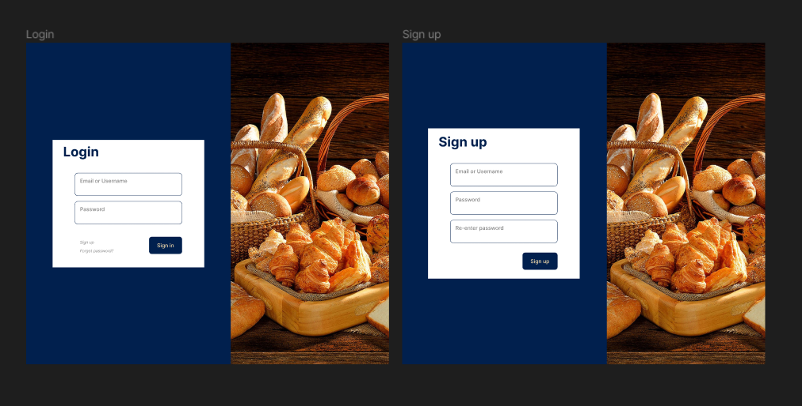
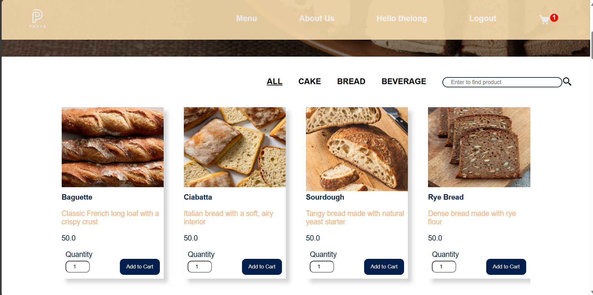
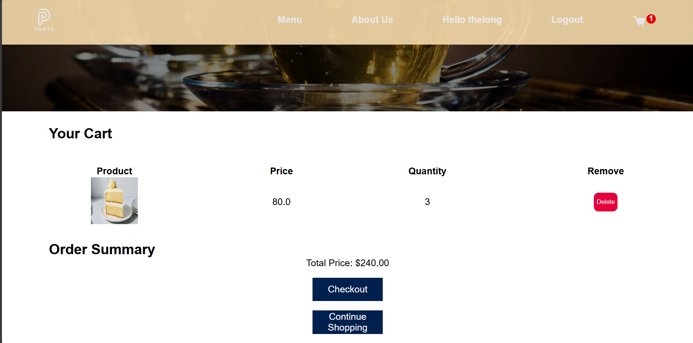
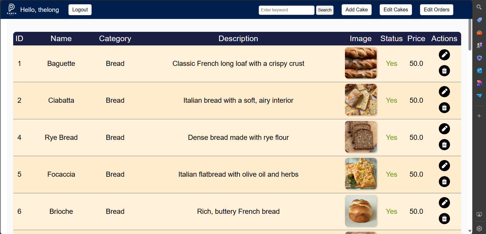
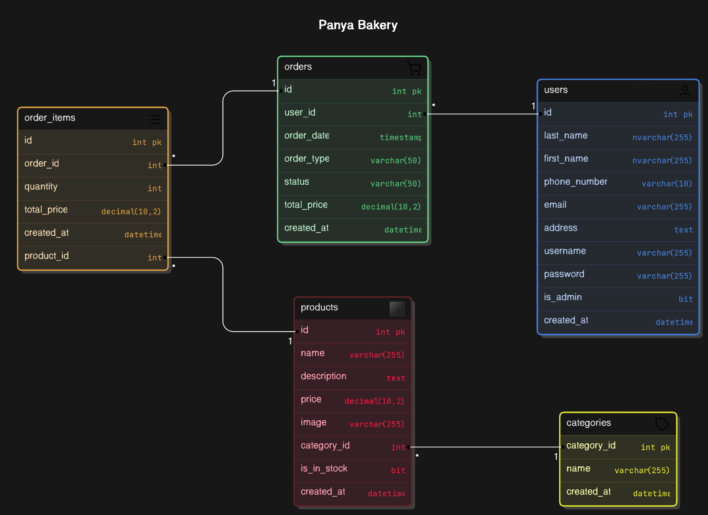
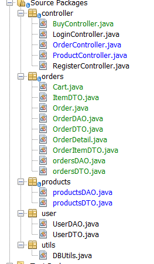
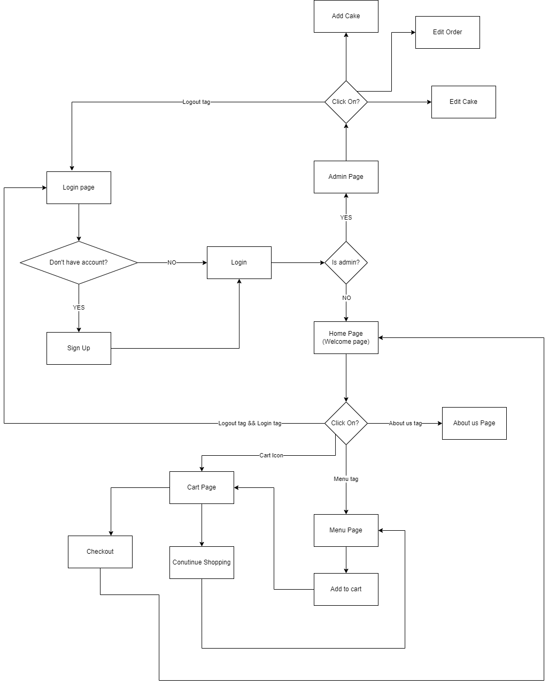

# Project: Online Bakery Shop

## Introduction
This project aims to create an online bakery website called Panya. The goal is to provide the shop with an online interface that allows customers to easily follow and place orders. The target users are customers purchasing cakes.

## Members
- Nguyễn Minh Nhật - SE183524
- Nguyễn Quang Nguyên - SE183591
- Lê Minh Thống - SE183545

## Features
We have exciting features planned for the future:   
### CUSTOMER
- **Menu**: List of Cake.   
- **Cake Orders**:       
          1. Pre-order: Allowing users to pre-order fresh pastries and cakes.         
          2. Cart: Allowing users to buy and pay for cakes online then ships to user's according address.
- **Login Membership**: Enable user accounts for managing orders and accessing member-exclusive features.   
- **Filter**: Cake types can be filtered according to the user's choice.

### ADMIN
- **Management**: Allowing admins to add, remove and update cakes from menu.
- **Stocks check**: Admins are able to check on orders and stocks.

 ## Project GUI Design

 **Main**:

  

  

  **Login/Sign up**:

  

**Menu**: 

  

**Cart**:

  

**Admin**:

  

## Database Model:

## Source Packages:

## Flow chart:

